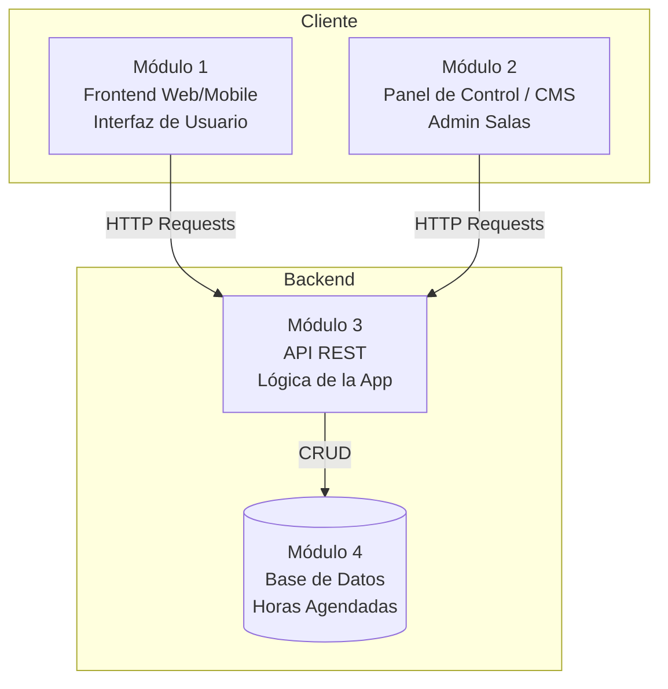

## 1. Estilo Arquitectónico

Estilo adoptado: Arquitectura REST

Justificación basada en REF priorizados:

| REF ID | Descripción | Prioridad | Cómo lo aborda el estilo |
|---|---|---|---|
| REF-01 | Calidad de servicio (Perf.)  | El sistema debe responder en menos de 2 segundos en operaciones comunes    | Alta      |
| REF-02 | Calidad de servicio (Disp.)  | El sistema debe estar disponible al menos un 99% en horario operativo      | Alta      |
| REF-03 | Calidad de servicio (Seg.)   | Solo usuarios autenticados pueden reservar, cancelar o modificar reservas  | Alta      |
| REF-04 | Calidad de servicio (Usab.)  | La interfaz debe ser simple e intuitiva para estudiantes y administradores | Alta      |
| REF-07 | Calidad de servicio (Mant.)  | El sistema debe ser modular y de bajo acoplamiento                         | Alta      |
| REF-10 | Calidad de servicio (Conf.)  | Los datos de reservas deben mantenerse consistentes en todo momento        | Alta      |

Explicación textual:  
Se adopta un estilo REST que desacopla la presentación de la lógica de negocio. El sistema se organiza en torno a recursos (Salas, Reservas) accesibles mediante una interfaz uniforme. Esta elección garantiza que tanto la aplicación para estudiantes como el panel de administración consuman la misma lógica de negocio, asegurando integridad y permitiendo que cada parte del sistema evolucione de forma independiente.

## 2. Diagrama de Arquitectura

## 3. Descomposición Modular

Fundamentación:  
La descomposición se basa en una arquitectura de sistemas distribuidos, separando las interfaces de cliente según el rol del usuario y centralizando la lógica y persistencia en un Backend robusto.

### Módulo 1: Frontend Web/Mobile (Interfaz de Usuario)
- **Responsabilidad:** Proveer la interfaz principal para que los estudiantes visualicen, filtren y reserven salas de estudio.
- **Ofrece a otros módulos:** Captura de datos de usuario y solicitudes de reserva.
- **Depende de:** API REST (Módulo 3).

### Módulo 2: Panel de Control / CMS (Admin Salas)
- **Responsabilidad:** Interfaz dedicada a administradores para la gestión de inventario de salas, configuración de reglas y visualización de métricas.
- **Ofrece a otros módulos:** Comandos de configuración y administración del sistema.
- **Depende de:** API REST (Módulo 3).

### Módulo 3: API REST (Lógica de la App)
- **Responsabilidad:** Orquestar la lógica de negocio, validar autenticación, verificar disponibilidad de salas y procesar transacciones.
- **Ofrece a otros módulos:** Endpoints REST (servicios) para los clientes.
- **Depende de:** Base de Datos (Módulo 4).

### Módulo 4: Base de Datos (Horas Agendadas)
- **Responsabilidad:** Almacenamiento persistente de toda la información del dominio (usuarios, salas, reservas y reglas).
- **Ofrece a otros módulos:** Operaciones de lectura y escritura de datos (CRUD).
- **Depende de:** Ninguno.

## 4. Decisiones de Diseño

### Decisión 1
- **Decisión:** Implementar dos clientes independientes (Frontend y Panel de Control).
- **Motivación:** Separa las preocupaciones de seguridad y usabilidad entre estudiantes y administradores (REF-04, REF-07).
- **Impacto:** Mayor seguridad al aislar funciones administrativas.

### Decisión 2
- **Decisión:** Uso de API REST como único punto de acceso a datos.
- **Motivación:** Asegura que todas las reglas de negocio se apliquen de forma consistente (REF-10).
- **Impacto:** Facilita el mantenimiento y futuras integraciones.
