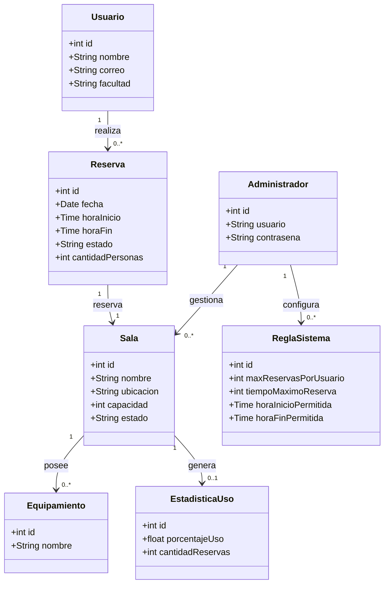

# Sala de Estudio

## Descripción del sistema
Sala de Estudio es una aplicación web orientada a estudiantes universitarios para visualizar salas de estudio disponibles, reservar espacios, cancelar reservas y consultar información relevante como ubicación, capacidad y equipamiento. Además, considera funcionalidades de administración para gestionar salas, visualizar estadísticas de uso y configurar reglas del sistema.

## Historias de Usuario
Todas las historias están registradas como GitHub Issues.

| ID | Nombre | Issue |
| :--- | :--- | :--- |
| US-01 | Ver ubicación de salas | [#3](https://github.com/Proyecto-sala-de-estudio/sala-de-estudio/issues/3) |
| US-02 | Ver capacidad de salas | [#4](https://github.com/Proyecto-sala-de-estudio/sala-de-estudio/issues/4) |
| US-03 | Reservar sala rápidamente | [#5](https://github.com/Proyecto-sala-de-estudio/sala-de-estudio/issues/5) |
| US-04 | Cancelar reserva | [#6](https://github.com/Proyecto-sala-de-estudio/sala-de-estudio/issues/6) |
| US-05 | Prioridad por facultad | [#7](https://github.com/Proyecto-sala-de-estudio/sala-de-estudio/issues/7) |
| US-06 | Ver equipamiento de salas | [#8](https://github.com/Proyecto-sala-de-estudio/sala-de-estudio/issues/8) |
| US-07 | Filtrar salas por características | [#14](https://github.com/Proyecto-sala-de-estudio/sala-de-estudio/issues/14) |
| US-08 | Gestionar salas | [#11](https://github.com/Proyecto-sala-de-estudio/sala-de-estudio/issues/11) |
| US-09 | Ver uso de salas | [#12](https://github.com/Proyecto-sala-de-estudio/sala-de-estudio/issues/12) |
| US-10 | Configurar reglas del sistema | [#13](https://github.com/Proyecto-sala-de-estudio/sala-de-estudio/issues/13) |

## Requisitos Extrafuncionales
Ver: [ReqExtrafuncionales.md](./ReqExtrafuncionales.md)

## Entidades del Dominio

## Mockups
| Mockup | Historia de usuario relacionada |
| :--- | :--- |
| [Prototipo en Figma](https://www.figma.com/design/4vkMNlZ1Hg1iXFpn5t1Kz1/proyecto-sala-de-estudio?node-id=0-1&t=aOCrCvCORP4L3zaH-1) | US-01 a US-10 |

## Diseño Arquitectónico
Ver: [Arquitectura.md](./Arquitectura.md)

| Integrante | Rol           | Ítems de la rúbrica a cargo         |
| ---------- | ------------- | ----------------------------------- |
| Vicente    | Scrum Master  | [1.1 Historias de Usuario - 2.3 Mockups]                         |
| Matías     | Product Owner | [1.2 Requisitos Extrafuncionales - apoyo general en coherencia]  |
| Nacho      | Developer     | [2.1 Diseño Arquitectónico - 2.2 Diagrama de Arquitectura]       |
| Martín     | Developer     | [2.4 Entidades del dominio]                                      |
